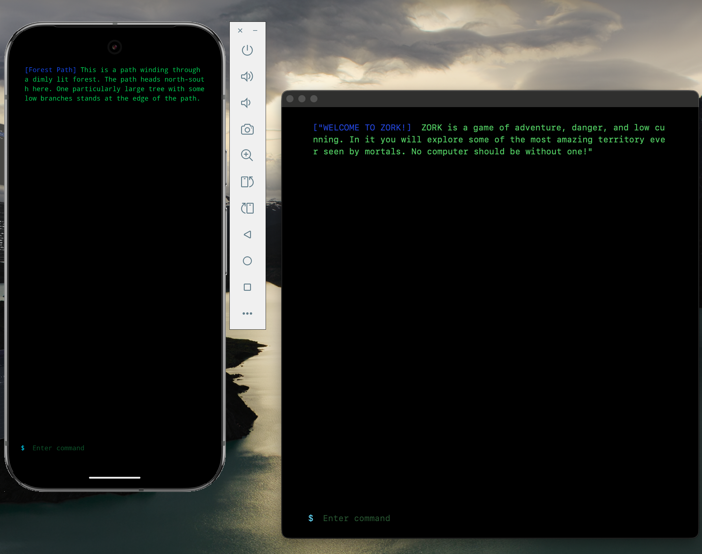

# Bare Zork

Zork everywhere

Powered by [Bare Native](https://github.com/holepunchto/bare-native), demonstrating "server" side rendering from the main Bare process rendering a Window and WebView cross platform.

Data is streamed!
* Rendering is handled via `Cellery render -> Transform -> Websocket`
* Inputs are handled via `Websocket -> Transform -> State Machine -> Cellery`

* [Coremachine](https://www.npmjs.com/package/coremachine)
* [Cellery](https://www.npmjs.com/package/cellery)
* [Zork Machine](https://www.npmjs.com/package/zork-machine)

Streaming state machine takes actions and performs state changes.



## Build

```
npm run build:all
```

## Install

### MacOS

```
open ./build/darwin-arm64/bare-zork.app
```

### iOS

```
xcrun simctl install booted ./build/ios-arm64-simulator/bare-zork.app
```

### Adnroid

```
adb -e install build/android-arm64/BareZork.apk
```

Linux and Windows supported but not tested

## Headless

To run headless and access remotely, run on `0.0.0.0`

Update the IP in `index.html`

* Run Zork:
```
./build/darwin-arm64/bare-zork.app --headless --host 0.0.0.0
```

* Serve HTML
```
npx serve -l tcp://0.0.0.0:3000
```

Go to `<your-ip>:3000` on your other device
